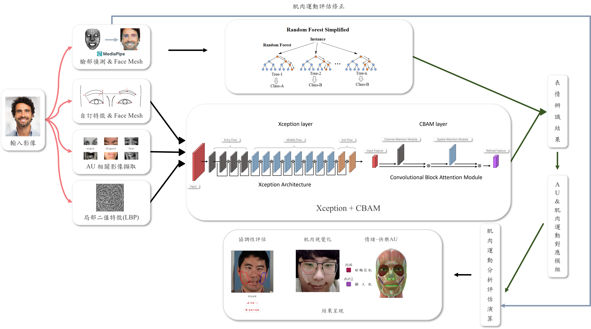
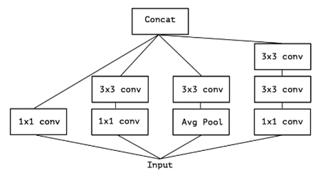
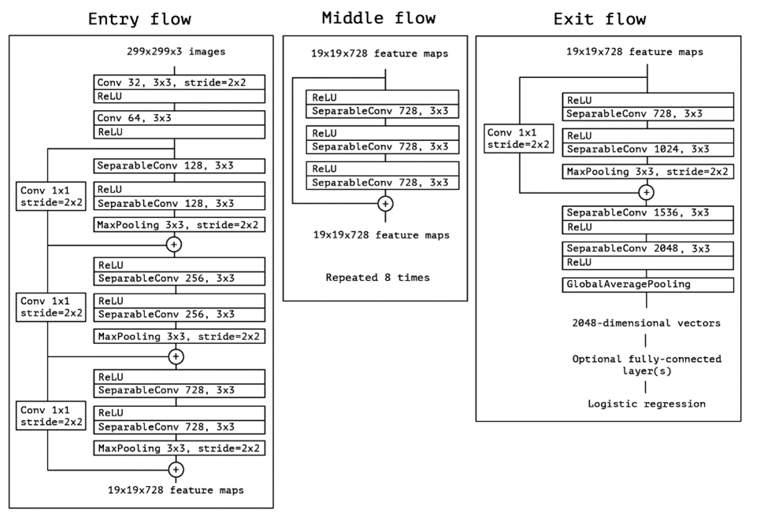
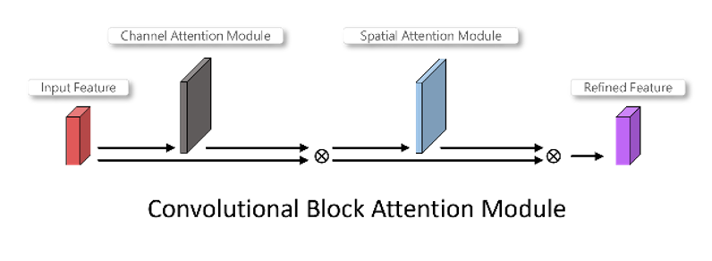

<h1 align="center" >基於深度學習之臉部表情肌肉運動評估</h1>
<h1 align="center" >Deep learning for Facial expression muscle movement assessments</h1>

    

# 目錄
>- 系統說明
>- 相關技術
>- 系統流程
>- 模型架構說明
>- 本專題系統模型說明
>- 系統相關操作說明影片

# 系統說明
<h4 style="text-align: justify;">
    本專題主要以機器學習方式評估臉部表情肌肉的運動狀況，藉此開發一套協助診斷臉部肌肉運動的評估系統。
    本系統結合MediaPipe的臉部網格模型（Face Mesh）與依據臉部肌肉動作單元（Action Unit，AU）之自訂特徵與其AU局部影像分別進行不同模型之訓練(即所謂組合式深度學習網路)來進行表情辨識，
    再利用AU與肌肉運動對應模組來產生臉部肌肉運動之分析與評估。此外，系統採用雲端伺服器技術，實現即時的評估與結果呈現。
</h4>

# 相關技術
>- 臉部動作編碼系統（Facial Action Coding System，FACS） 
<h4 style="text-align: justify;">
    臉部動作編碼系統(FACS)最初由瑞典解剖學家 Carl-Herman Hjortsjö 開發，
    後由美國心理學家 PAUl Ekman 和 Wallace V. Friesen 於1978年所發表，並於2002 進行改動。於先前臉部動作編碼系統(FACS)的基礎上，
    將臉部的各種動作劃分為不同的單元，這些單元被稱為"臉部肌肉動作單元(Action Unit，AU)"。
    AU通常用數字表示，並且都被賦予唯一的編號，不同AU代表著特定臉部肌肉或肌群的運動，
    例如AU1是內眉上提，AU6是臉頰上提等，涉及單一肌肉的運動或多個肌肉的協同作用。
    每個AU能夠對應不同臉部動作所使用到的肌肉，並使用這些編碼來比較和分析不同個體或情境下的臉部表情變化。 
</h4> 

>- MediaPipe 臉部網格介紹 
<h4 style="text-align: justify;">
    本專題使用到MediaPipe其自動臉部偵測與臉部網格（Face Mesh）模型，
    該模型能夠即時對臉部圖像生成約468個臉部3D (X、Y、Z軸)特徵點，並將其投射到二維影像上，
    作為臉部結構追蹤之重要參考依據，如圖1。其中可發現針對臉部主要結構有清楚的標記點資訊，
    其中並以網格(mesh)方式內插標記點，建立其主要結構連結資訊，而臉部曲面較為複雜處內插標記點越多(即mesh的密度越高)，
    此也將反映出臉部的肌肉群活動(凹凸程度)資訊。 
</h4> 

    
    <h4>圖1、臉部網格 (圖片來源: https://developers.google.com/mediapipe)</h4>

# 系統流程
<h4 style="text-align: justify;">
系統輸入為單張影像，藉由MediaPipe技術做出臉部偵測後，提取臉部圖像
的三維特徵。考慮到表情和臉部肌肉的主要活動都在正面上展現，若從側面擷取
會導致特徵偏移不準確，將以鼻為中心點將所有特徵點做正規化。後續，將其分
為2個子系統，個別擷取對應特徵並以不同模型進行訓練，最後再以隨機森林作
為分類器做表情辨識。以下將特徵分為三部分進行討論。 
</h4>

    
    <h4>圖2、系統流程圖</h4>

# 模型說明
<h4 style="text-align: justify;">
    本專題模型的建立是基於Xeption的預訓練網路(由ImageNet資料及訓練後的權重)，Xeption 
    是由 Inception 的架構延伸而來(圖 7(a))，
    主要理念是具有多尺寸濾波的 CNN 架構，其目的在保留細節特徵，較不易因梯度消失而被破壞。
    而Xception乃將此架構延伸並做串接，而形成更完整的網路框架(圖7(b))，除了多尺寸的濾波外，
    更使用 1x1 的捲機方式做出跨層的特徵整合，使其網路不但具有較少的參數也保留其多層特徵的特性。
    此外，在此基底模型後串接上將串接上注意力網路Convolutional Block Attention Module (CBAM)，
    用以將所學的特徵值再次萃取，保留可用特徵並降低無效特徵，其架構如圖7(c)。
</h4>

    
    <h4>圖1(a)、Inception-v3 架構示意圖</h4>
    
    <h4>圖1(b)、Xception網路架構示意圖</h4>
    
    <h4>圖1(c)、CBAM示意圖</h4>

>- 由於超過上傳限制，本專題系統使用之模型，放置於google雲端硬碟，網址: https://drive.google.com/drive/folders/1f8ws5u3OsfaRlpCaTlERSc7QMihSm0U2?usp=sharing

# 系統相關操作說明影片
<h4 style="text-align: justify;">
    本專題有另外錄製系統相關系統環境建置、操作、程式說明..等影片(包含: 從伺服器Anaconda環境建構 到 成功開啟web並操作、ngrok的安裝 & 使用、伺服器 & 網頁程式的講解 )
</h4>

>- 由於超過上傳限制，本專題相關操作說明影片，放置於google雲端硬碟，網址: https://drive.google.com/drive/folders/1frIJKcMg8L7DhP54NXZa4SYiYFd3Rzf7?usp=sharing

 
