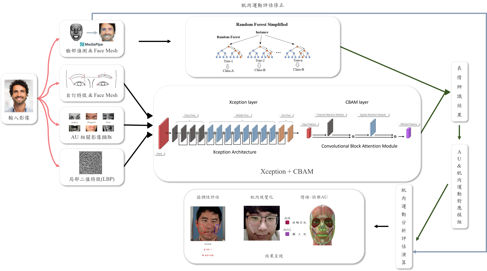
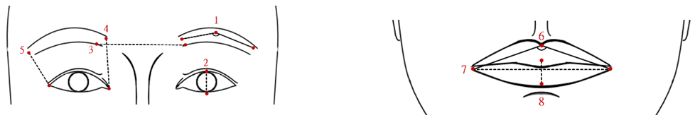
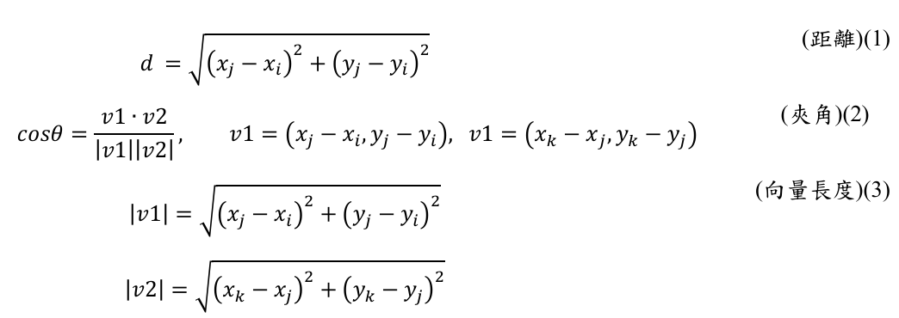
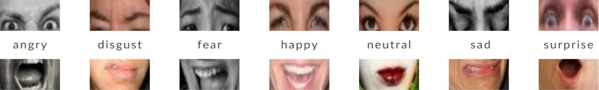
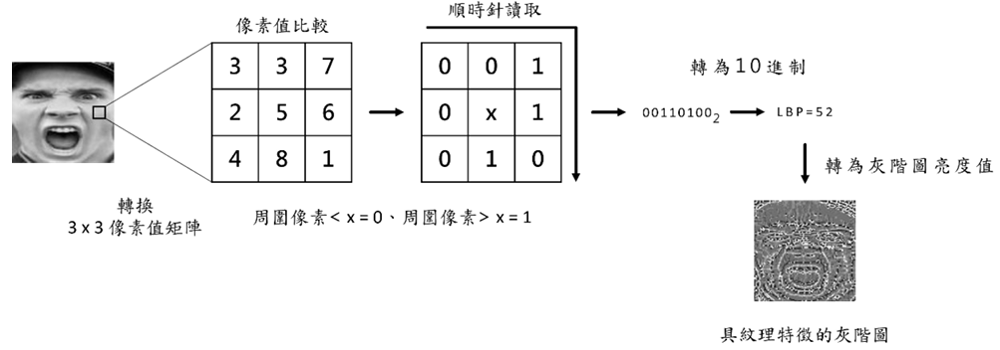
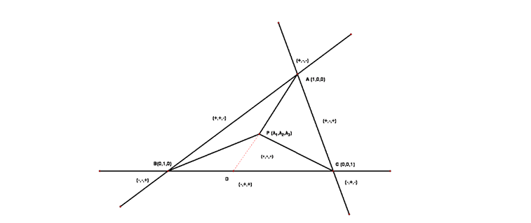
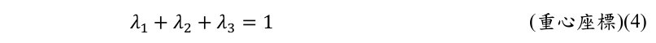
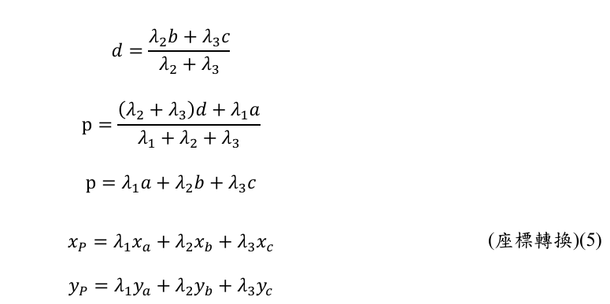

<h1 align="center" >基於深度學習之臉部表情肌肉運動評估</h1>
<h1 align="center" >Deep learning for Facial expression muscle movement assessments</h1>

    

# 目錄
>- 系統說明
>- 相關技術
>- 系統流程
>- 模型架構說明
>- 使用之數據集介紹 & 與預處理
>- 本專題模型相關配置說明
>- 系統環境與設備說明
>- 系統相關操作說明影片

# 系統說明
<h4 style="text-align: justify;">
    本專題主要以機器學習方式評估臉部表情肌肉的運動狀況，藉此開發一套協助診斷臉部肌肉運動的評估系統。
    本系統結合MediaPipe的臉部網格模型（Face Mesh）與依據臉部肌肉動作單元（Action Unit，AU）之自訂特徵與其AU局部影像分別進行不同模型之訓練(即所謂組合式深度學習網路)來進行表情辨識，
    透過 AU 與肌肉運動對應模組，將表情所牽動的肌肉部位以視覺化方式呈現在影像上，並嘗試透過臉部網格計算臉頰面積差異作為臉部協調性評估之依據。此外，系統採用Ngrok技術將系統網頁公開至互聯網，實現即時的評估與結果呈現。
</h4>

# 相關技術
>- 臉部動作編碼系統（Facial Action Coding System，FACS） 
<h4 style="text-align: justify;">
    臉部動作編碼系統(FACS)最初由瑞典解剖學家 Carl-Herman Hjortsjö 開發，
    後由美國心理學家 PAUl Ekman 和 Wallace V. Friesen 於1978年所發表，並於2002 進行改動。於先前臉部動作編碼系統(FACS)的基礎上，
    將臉部的各種動作劃分為不同的單元，這些單元被稱為"臉部肌肉動作單元(Action Unit，AU)"。
    AU通常用數字表示，並且都被賦予唯一的編號，不同AU代表著特定臉部肌肉或肌群的運動，
    例如AU1是內眉上提，AU6是臉頰上提等，涉及單一肌肉的運動或多個肌肉的協同作用。
    每個AU能夠對應不同臉部動作所使用到的肌肉，並使用這些編碼來比較和分析不同個體或情境下的臉部表情變化。 
</h4> 

>- MediaPipe 臉部網格介紹 
<h4 style="text-align: justify;">
    本專題使用到MediaPipe其自動臉部偵測與臉部網格（Face Mesh）模型，
    該模型能夠即時對臉部圖像生成約468個臉部3D (X、Y、Z軸)特徵點，並將其投射到二維影像上，
    作為臉部結構追蹤之重要參考依據，如圖1。其中可發現針對臉部主要結構有清楚的標記點資訊，
    其中並以網格(mesh)方式內插標記點，建立其主要結構連結資訊，而臉部曲面較為複雜處內插標記點越多(即mesh的密度越高)，
    此也將反映出臉部的肌肉群活動(凹凸程度)資訊。 
</h4> 

    
    <h4>圖1、臉部網格 (圖片來源: https://developers.google.com/mediapipe)</h4>

# 系統流程
<h4 style="text-align: justify;">
系統輸入為單張影像，藉由MediaPipe技術做出臉部偵測後，提取臉部圖像
的三維特徵。考慮到表情和臉部肌肉的主要活動都在正面上展現，若從側面擷取
會導致特徵偏移不準確，將以鼻為中心點將所有特徵點做正規化。後續，將其分
為2個子系統，個別擷取對應特徵並以不同模型進行訓練，最後再以隨機森林作
為分類器做表情辨識。以下將特徵分為三部分進行討論。 
</h4>

    
    <h4>圖2、系統流程圖</h4>

<h4 style="text-align: justify;">
第一部分以擷取臉部網格之局部自訂特徵(local features,LFs)為主，並嘗試以
隨機森林模型來訓練。自訂特徵主要用意在表現臉部表情特性，此部分參照FACS
中AUs 部位，自訂出各AU中具有與表情表現相關的標記點的幾何資訊，如圖
3 所示。如眼眉部分將紀錄眉毛中心與眉頭和尾的距離與角度關係，嘴巴部分也
將記錄嘴部張開或閉起等資訊作為特徵，而其他與臉部肌肉運動相關部分也將嘗
試採用為特徵值，並於模型訓練後理解各部位特徵的表現性。
</h4>

    
    <h4>圖3、局部自訂特徵示意圖 (local features,LFs) </h4>

<h4 style="text-align: justify;">
其記錄方式採用座標向量，記錄雙眉間、眼角與嘴角的相關特徵，並通過計
算距離與向量間的夾角來描述臉部肌肉運動的幾何關係，公式如下圖4(1)(2)(3)，其
中 i, j, k 分別表示不同點。
</h4>

    
    <h4>圖4、局部特徵紀錄公式</h4>

<h4 style="text-align: justify;">
第二部分以全臉影像(Full Face Image)與 AU 相關影像擷取為主，此部分是
對各種不同表情的圖像其不同的AU區塊進行擷取，獲取不同表情下其AU的特
徵，如圖5所示。此部分以影像辨識為基礎，主要彌補標記點資訊之不足，而表
情表現出的肌肉活動資訊也將呈現於影像紋路資訊中。 
</h4>

    
    <h4>圖5、AU特徵擷取示意圖 (圖片來源: 
https://www.kaggle.com/datasets/shuvoalok/raf-db-dataset) </h4>

<h4 style="text-align: justify;">
第三部分以由全臉影像產生之紋理特徵為主，採用Local binary pattern (LBP) 
演算，得出LBF 二維特徵作為輔助特徵來進行辨識。其特徵計算之如示意圖如
下。
</h4>

    
    <h4>圖6、LBP示意圖</h4>

# 模型架構說明
<h4 style="text-align: justify;">
    本專題模型的建立是基於Xeption的預訓練網路(由ImageNet資料及訓練後的權重)，Xeption 
    是由 Inception 的架構延伸而來(圖 7(a))，
    主要理念是具有多尺寸濾波的 CNN 架構，其目的在保留細節特徵，較不易因梯度消失而被破壞。
    而Xception乃將此架構延伸並做串接，而形成更完整的網路框架(圖7(b))，除了多尺寸的濾波外，
    更使用 1x1 的捲機方式做出跨層的特徵整合，使其網路不但具有較少的參數也保留其多層特徵的特性。
    此外，在此基底模型後串接上將串接上注意力網路Convolutional Block Attention Module (CBAM)，
    用以將所學的特徵值再次萃取，保留可用特徵並降低無效特徵，其架構如圖7(c)。
</h4>

    
    <h4>圖7(a)、Inception-v3 架構示意圖</h4>
    
    <h4>圖7(b)、Xception網路架構示意圖</h4>
    
    <h4>圖7(c)、CBAM示意圖</h4>

>- 臉部網格之AU與肌肉對應模組 
<h4 style="text-align: justify;">
    本專題利用 MediaPipe 的臉部網格模型，根據每個 Action Unit (AU) 對應的肌肉部位，標記其在臉部網格模型上的大致位置，
    同時將這些區域的特徵編號進行紀錄。比如微笑能透過組合 AU6 (眼輪匝肌的拉動) 和 AU12 (顴大肌的拉動) 表現出來，
    如圖8左圖，而難過則是藉由AU1(額肌的拉動)、 AU4 (降眉肌的拉動) 和 AU15 (降口角肌的拉動) 表現出來，如圖 8 右圖。
    據此方式目前已經標記出用於確定情緒的主要動作單元約 46 種。
</h4>

    
    <h4>圖8、AU與肌肉對應及其網格標記 (參考: 3Dbody解剖軟體: 
https://apps.apple.com/tw/app/3dbody%E8%A7%A3%E5%89%96/id1003630908 )</h4>

>- 重心座標插值演算
<h4 style="text-align: justify;"> 
在將臉部肌肉與網格位置對應時，不一定每塊肌肉都有對應的網格點特徵。
因此，本研究透過重心座標公式進行插值之方法，通過對所需位置附近已知的網
格點位置進行演算，來改善 MediaPipe 臉部網格模型的精確性。
</h4>

>- 基於重心座標插值演算

系統輸入單張圖像，藉由 MediaPipe 技術做出臉部偵測後，提取臉部圖像
的三維特徵。以此對臉部網格與臉部肌肉位置進行對應,當肌肉位置上無對應網
格點特徵,則透過重心座標的計算，可以找到足夠靠近紅點處(所需位置)來進行插
值，如圖9。藉此獲得紅點p之重心座標。接著，通過重心座標轉換公式將其轉換
為笛卡兒座標系，如以下公式(4)(5)。 
</h4>

    
    <h4>圖8、三角形重心座標示意圖 </h4>

    
  </h4>

    
    <h4>圖8、重心座標公式</h4>

>- 最佳化定位搜尋
<h4 style="text-align: justify;">
在此搜尋算法中，將透過影像RGB資訊與臉部網格(Face Mesh)定位出肌肉
點位置。首先，將以手動方式將肌肉邊緣圈出，並將此影像與網格影像重疊。接
著針對肌肉邊緣進行取樣，每一取樣點𝑆𝑃將搜尋其最靠近的特徵點群，並透過重
心座標的計算，不斷迭代直至足夠靠近紅點處(所需位置)進行插值，如表1與圖
10 所示。 
</h4>

# 使用之數據集介紹 & 與預處理
<h4 style="text-align: justify;">
    本專題採用 Real-world Affective Faces Database (RAF-DB) 數據集，該數據集包含七種情緒類別：
    生氣(Angry)、厭惡(digest)、害怕(fear)、快樂(Happy)、難過(Sad)、驚訝(surprise)和無表情(nature)，
    共超過 14,000 張彩色圖像，圖像尺寸均為 100×100 像素，並且數據集已提供訓練集和測試集的劃分。
    鑑於 RAF-DB 數據集中存在部分模糊不清的圖像以及數據分布不平衡的問題
    (資料個數: 生氣：705、厭惡：717、害怕：281、快樂：4772、無表情：2524難過：1982、驚訝：1290)，
    本專題對數據進行以下處理：首先利用 MediaPipe 的臉部網格技術進行臉部偵測，剔除無法檢測到臉部的圖像；
    其次，通過複製與刪除操作調整數據分布，將每類情緒的圖像數量平衡至接近 2000 張。
</h4>

# 本專題模型相關配置說明
<h4 style="text-align: justify;">
    本專題系統目前使用其中3類（生氣angry、快樂happy和無表情natural）進行訓練，
    相關模型超參數設置如下: Xception+CBAM 模型(learning rate)為 0.001, L2-regularization 為 0.01, training batch size 為 32, test batch size 為 32, epoch 為 40。
    其中優化器(optimizer)使用Adam。
</h4>

>- 由於超過上傳限制，本專題系統使用之模型，放置於google雲端硬碟，網址: https://drive.google.com/drive/folders/1f8ws5u3OsfaRlpCaTlERSc7QMihSm0U2?usp=sharing

# 系統環境與設備說明
<h4 style="text-align: justify;">
    本專題系統建構於Ubuntu 24.04.2 LTS的anaconda環境(anaconda環境檔於文件中可找到)，編程語言為Python，模型訓練時有使用GPU加速，顯卡為NVIDIA GeForce RTX 3060。
</h4>

# 系統相關操作說明影片
<h4 style="text-align: justify;">
    本專題有另外錄製系統相關系統環境建置、操作、程式說明..等影片(包含: 從伺服器Anaconda環境建構 到 成功開啟web並操作、ngrok的安裝 & 使用、伺服器 & 網頁程式的講解 )。
</h4>

>- 由於超過上傳限制，本專題相關操作說明影片，放置於google雲端硬碟，網址: https://drive.google.com/drive/folders/1frIJKcMg8L7DhP54NXZa4SYiYFd3Rzf7?usp=sharing

 
