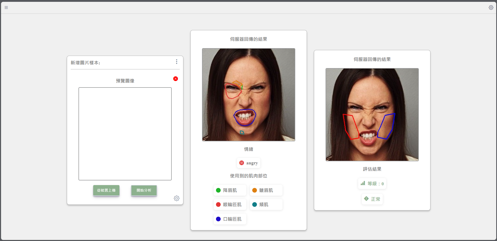

<h1 align="center" >基於深度學習之臉部表情肌肉運動評估</h1>
<h1 align="center" >Deep learning for Facial expression muscle movement assessments</h1>

    

# 系統說明
<h5 style="text-align: justify;">本專題主要以機器學習方式評估臉部表情肌肉的運動狀況，藉此開發一套協助診斷臉部肌肉運動的評估系統。
    本系統結合MediaPipe的臉部網格模型（Face Mesh）與依據臉部肌肉動作單元（Action Unit，AU）之自訂特徵與其AU局部影像分別進行不同模型之訓練(即所謂組合式深度學習網路)來進行表情辨識，
    再利用AU與肌肉運動對應模組來產生臉部肌肉運動之分析與評估。此外，系統採用雲端伺服器技術，實現即時的評估與結果呈現。
    有關臉部表情辨識與肌肉評估之主要流程如圖1。</h5>

# 系統流程
<h3 style="text-align: justify;">    本專題主要以機器學習方式評估臉部表情肌肉的運動狀況，藉此開發一套協助診斷臉部肌肉運動的評估系統。
    本系統結合MediaPipe的臉部網格模型（Face Mesh）與依據臉部肌肉動作單元（Action Unit，AU）之自訂特徵與其AU局部影像分別進行不同模型之訓練(即所謂組合式深度學習網路)來進行表情辨識，
    再利用AU與肌肉運動對應模組來產生臉部肌肉運動之分析與評估。此外，系統採用雲端伺服器技術，實現即時的評估與結果呈現。
    有關臉部表情辨識與肌肉評估之主要流程如圖1。</h3>

    
    <h3>圖1、系統流程圖</h3>

# 模型說明
本專題系統使用之模型，用於訓練的資料集為kaggle的實際臉部資料集(raf-db)，取三類進行訓練(生氣、快樂、無表情)，每類通過複製和刪減平衡至2000張，批次 ep 準確率

>- 本研究目前已成功透過 MediaPipe 臉部網格，清楚定位臉部肌肉相對於網格的位置。同時，結合雲端伺服器和表情辨識技術，實現即時的臉部表情偵測。
>- 本學期之研究方向，將基於以上初步研究成果，進一步完善臉部肌肉定位系統，針對更深層的肌肉牽動問題提出解決方案。並著重於探討臉部肌肉變化對於表情辨識模型訓練的關聯性。
>- 
>- 由於超過上傳限制，本專題使用之模型，放置於google雲端硬碟，網址: https://drive.google.com/drive/folders/1f8ws5u3OsfaRlpCaTlERSc7QMihSm0U2?usp=sharing
>- 由於超過上傳限制，本專題相關操作說明影片( 包含: 從伺服器Anaconda環境建構 到 成功開啟web並操作、ngrok的安裝 & 使用、伺服器 & 網頁程式的講解 )，放置於google雲端硬碟，網址: https://drive.google.com/drive/folders/1frIJKcMg8L7DhP54NXZa4SYiYFd3Rzf7?usp=sharing
 
 width="500" height="420"
